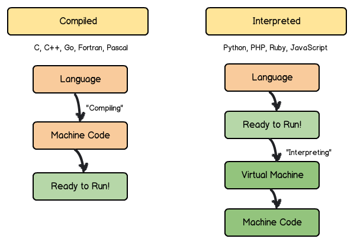

# Ada Programming Languages

Programming languages exist so that humans can give instructions to computers. It's all about communication. 

## Classification

There are two main ways to classify programming languages: by level and by type (compiled or interpreted).

## Level
The "level" of a language describes how close the language is to being binary code. Binary code is a two-symbol system that computers use to represent text or other data - just by using 0's and 1's. 

Low-level languages, such as C, are more difficult for humans to read compared to other programming languages. In comparison, high-level languages (such as Java, Python, and Ruby) tend to be more abstract and easier for humans to read. High-level languages take care of the background tasks for the software developer. 

## Type (Compiled or Interpreted)

Compilers and interpreters take human-readable code and convert it to the computer-readable machine code. 

In a compiled language, the target machine directly translates the program. In an interpreted language, the source code is not directly translated by the target machine. The interpreter reads and executes the code.
### Compiled Languages
Compiled lanuages are converted into binary code before they are executed. These include C, C++, and Java to name a few.
Compiled languages are converted directly into machine code that the processor can execute. As a result, they tend to be faster and more efficient to execute than interpreted languages. Compiled languages also give more control over hardware aspects such as CPU usage and memory management. 

### Interpreted Languages
Interpreted languages can be translated or executed directly. The code does not get directly converted into binary. The program that runs the code is the one that communicates directly with the computer. Interpreters run through a program line by line and execute each command. These interpreted languages include Python, Ruby, PHP, JavaScript.

### Pros & Cons

Advantages of Compiled Languages: 
Programs that are compiled into native machine code tend to be faster than interpreted code because the process of translating code at run time adds to the overhead. This can cause the program to be slower overall.

Disadvantages of Compiled Languages:
Additional time needed to complete the entire compilation step before testing.

Platform dependence of the generated binary code

Advantages of Interpreted Languages:
Interpreted languages tend to be more flexible and usually offer features such as dynamic typing and smaller program size. 

The code is platform independent since the interpreters execute the source program code themselves.

Disadvantages of Interpreted Languages:
Slower execution speed compared to compiled languages.
## Dynamically vs. Statically Typed 

All languages include some kind of type system that formalizes which categories of objects it can work with and how those categories are treated. 

Python is a dynamically typed language. The Python interpreter does type checking only as the code runs. As you execute a line of code, that's when the type checking occurs. Also, the type of variable is allowed to change over its lifetime.

In statically typed languages, type checks are performed without running the program. The type checks are is usually done with the program is compiled (BEFORE its executed). The type of variable is not allowed to change over its lifetime. It's fixed as it's defined. 

## Languages
### Python
Python is a high-level, dynamically typed language. It was created by Guido van Rossum in 1991. Python was originally a hobby programming project to Van Rossum to keep busy during the holidays. He chose the name Python because he's a fan of Monty Python's Flying Circus. 

Python can run on many different platforms (Mac, Windows, Linux, etc) and has intuitive syntax. It is open source and is widely used for web development (server side), OS scripting, mathematics, artificial intelligence, and data science. 

Ada Developers Academy teaches introductory Object-Oriented programming in Python and server-side web development.
### HTML & CSS
HTML (Hyper-Text Markup Language) is a markup language. CSS (Cascading Style Sheets) is a style sheet language. These two work together for structuring and styling the content of a web page. 

HTML is the "skeleton" of a web page. It provides the set up and structure for how each part of the web page is organized. 

CSS is the "clothes" of the skeleton. It specifies how each piece looks (size, color, etc) and its relationship to other elements of the web page. 
### JavaScript
JavaScript is another high-level dynamically typed language. JavaScript is used with HTML & CSS to provide a dynamic and responsive experience for the user. 
### Frameworks
Frameworks let us leverage the hard work of previous software developers so that we can create software more quickly. Frameworks make it possible to build and deploy applications. They can include programs, compilers, libraries, toolsets, and application programming interfaces (APIs).

### Flask
Flask is a Python micro-framework for creating web applications. Flask has a simple core which is designed to be extensible to build powerful web applications.

Flask is used at Ada - for teaching server-side web development. 
### ReactJS
ReactJS is a JavaScript framework for building user interfaces. React lets front-end developers organize their application and provide quick and powerful single-page-applications (SPAs). 

Additional Sources:
* https://www.freecodecamp.org/news/compiled-versus-interpreted-languages/
* https://realpython.com/lessons/dynamic-vs-static/